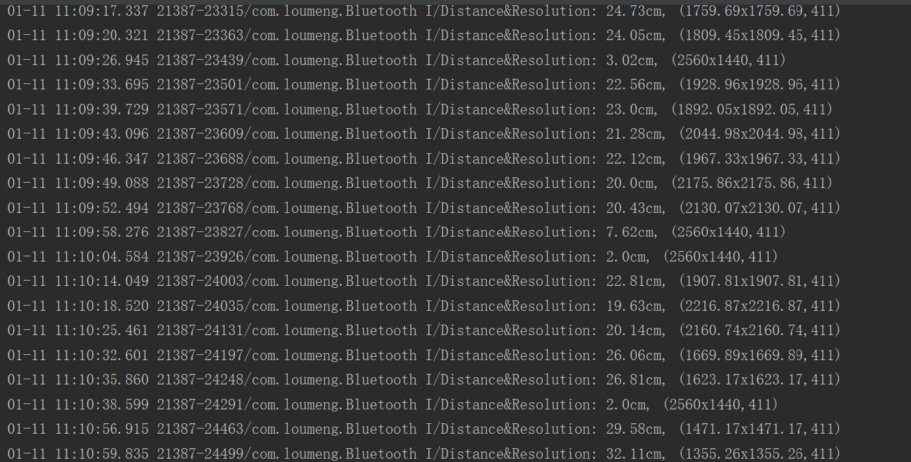

# **Dynamic Resolution Scaling System** 

Xinran Chen, Xuanrui Hong, Shuyuan Fu, Hong Zhang, @SJTU-CSE

## **简介**

人类的视觉可感知能力受限于距离。当用户到屏幕的距离较大时，适当降低显示分辨率仍可维持相同的用户体验，这为智能手机的节能提供了新的思路。本项目基于 [MobiCom 2015: Optimizing Smartphone Power Consumption through Dynamic Resolution Scaling](https://doi.org/10.1145/2789168.2790117) 一文，尝试实现一个简易的用于智能手机的动态分辨率缩放系统。该系统采用低功耗成本的超声波测距方法来获得用户屏幕距离，并自动做出分辨率缩放决策，以最大程度地在保证用户体验的同时节省功耗。本系统在Nexus 6P安卓智能手机上实现，使用超声波模块测距，通过蓝牙进行数据传输，根据接收的数据实时计算分辨率的优化值，并通过 wm 指令动态修改安卓手机分辨率。

## **实现概述**

整个 DRS 系统分为硬件和软件两个部分。

硬件部分包含 HC-SR04 超声波模块、HC-05 蓝牙模块和用于控制和计算的微处理器。微处理器负责完成距离的计算，并控制蓝牙串口的数据发送。本项目用于实验的微处理器单片机为 Arduino uno r3。需要的控制和计算并不复杂，因此有条件的话可以考虑采用体积更小、更精简的微处理器。为了让蓝牙正常工作，在完成必要的接线后，前期需要利用单片机对 HC-05 蓝牙模块进行初始化和调试。此外，需要编写单片机的控制和计算距离的相关代码，并烧写到单片机中，较为简单，这里都不再详述。

软件部分封装在一个用 Java 语言实现的蓝牙串口APP中。该APP实现实时读取距离参数以及根据距离参数调整分辨率。软件部分相关的所有工程代码见 `/DRS-APP`。软件框架如下：

以下将对软件部分的实现细节进行具体阐述。

## **蓝牙传输**

在 `BluetoothChat` 主活动的 `oncreate()` 函数中通过 `BluetoothAdapter` 类的 `getDefaultAdapter()` 方法获取本地蓝牙适配器。通过注册 `search` 按键监听函数，当用户按下搜索设备时，利用 `intent` 进入 `DeviceListActivity`活动进行蓝牙设备搜索。该 `Activity` 显示为一个对话框，列出所有已配对设备和在附近搜索到的设备。当某设备被用户点击选择后，该设备的 MAC 地址会在 `result Intent` 中被传回到主 `Activity` 。其中获取配对设备通过 `getBondedDevices()` 函数。在主活动中通过设备的 MAC 地址，获取 `BluetoothDevice` 类型的设备。

在 `BluetoothChat` 主活动的 `onStart()` 函数中首先利用 `isEnabled()` 函数判断本地蓝牙是否开启，如果未开启则向用户显示信息请求开启，如果已开启则设置聊天会话。在初始化聊天回话 `setupChat()` 函数中需要创建一个 `BluetoothChatService` 类的实例，这个类包含所有设置与管理与其他蓝牙设备进行连接的工作。

下面介绍 `BluetoothChatService` 类。该类的构造函数所传递参数为 `Context` 和 `Handler`，`Handler`用于向主活动中传递消息。在本项目中只涉及安卓手机接收 HC-05 蓝牙模块的数据消息，手机端作为客户端发起连接，HC-05 蓝牙模块作为服务端，所以这里主要介绍 `BluetoothChatService` 类中的2个线程，分别为向其他设备发起连接的 `ConnectThread` 和负责连接后数据传输的 `ConnectedThread`。

* `ConnectThread` 线程。`ConnectThread` 的构造函数需要的参数类型为 `BluetoothDevice`，即本机将发起连接的设备。蓝牙串行端口基于SPP协议，能在蓝牙设备之间创建串口进行数据传输。SPP 的 UUID 为 `00001101-0000-1000-8000-00805F9B34FB` 。

* 通过 `BluetoothDevice.createRfcommSocketToServiceRecord(uuid)` 方法获取与给定蓝牙设备连接的 `BluetoothSocket`，本机通过 `socket` 与 HC-05 蓝牙模块进行通信。

* `ConnectedThread` 线程。`ConnectedThread` 的构造函数需要的参数为 `BluetoothSocket`类型，利用 `socket.getInputStream()` 获取输入流，`socket.getOutputStream()` 获取输出流。在 `run()` 函数中利用 `while(true)` 循环检测是否有数据流入，若有数据流入，通过 `instream.read(buffer)` ( `buffer` 为字节数组)读取数据，通过 `Handler` 将消息传回主活动。

在主 UI 设计中设置 `TextView` 类型的组件，用于显示接收到的数据。在主活动设置聊天会话函数中根据 id 找到该文本框组件，设置变量名为 `myConversationView` 。当接收到数据时，存放在字节数组 `readBuf` 中，然后将其转换为字符串，存储在 `readMessage` 中。通过 `myConversationView.append(readMessage)` 方法更新UI界面，将接收到的数据显示在 APP 上。DRS 蓝牙串口通信界面如下，显示的数字即为实时测得的用户到屏幕的距离（cm）。

## **动态分辨率调整**

根据原论文，如果用 `δ = 2.9×10−4 radians` 描述正常视力，用户屏幕距离和用户视敏度之间的关系可以使用如下公式近似描述：

其中，N是可分辨的像素数，L是显示器的较长边的长度，D是用户的屏幕距离，δ是用户的角度分辨力。

本项目选取具有正常视力的用户角度分辨力，通过该公式计算出用户的可分辨率像素数，作为分辨率调整的参数。如何调整分辨率？原论文在 OpenGL 渲染流水管线中插入两个 DRS 进程，通过二进制重写技术，修改 OpenGL 的窗口绘制函数参数，并更改 `prepare()` 函数的调用参数，通过硬件编辑器将像素块放缩到原始大小，来实现分辨率缩放。实现较为困难。本项目通过 wm 指令实现动态修改安卓手机分辨率，且调整分辨率是实时且透明的。计算出分辨率参数后，该软件自动调用 `wm size` 命令，修改分辨率。分辨率调整的软件实现中，需要完成以下步骤：
* 参数选择：
由于分辨率修改有一定的延时，但距离传回是实时且密集的，如果每传回一个距离参数都要进行一次分辨率修改，调整过于密集，可能造成卡顿或过大的系统开销。且由于在一段较短时间内，用户屏幕距离改变不大，过于频繁的分辨率调整没有意义。因此，我们选取一个合适的时间段作为分辨率调整的间隔。在本项目中，仅简单的通过设定接收到的传回参数的数目，每接收30个参数（约2s）更新一次分辨率。
由于外界干扰，有时传回的值过大或过小，计算出的分辨率大小会过小（低于最低分辨率）或过大（高于物理分辨率）。这个值超出了调整范围，且有一定的概率是错误的。本项目中设定一个阈值（540x960-1440x2560），超出范围的值均以阈值大小记。其他分辨率直接作为参数传给 `Resolution` 类。

* 获取root权限：
执行 wm 指令需要获取手机 root 权限，软件每修改一次分辨率之前，都会弹出相应的权限获取请求，因此，基于用户参与的单次调整分辨率权限获取是容易的，但这对用户来说是不透明的，无法满足本项目自动调整分辨率的需求。
无需用户参与来实现动态调整最为直观的方法是使软件长期获得 root 权限。这从编程上实现有些困难，但现在市面上商用的权限管理软件可以解决该问题。用户只需对本小组开发的软件进行一次授权（或每次开启软件时授权），软件就可以实现自动的分辨率调整。

* 执行命令行：
在 Java 中，`RunTime.getRuntime().exec()`实现了调用服务器命令脚本来执行功能。
由于分辨率调整命令是特权命令，在执行命令 `wm size RxxRy`（Rx，Ry为分辨率参数）前需要判断软件是否已获得权限，并需在命令前加 `su` 。

在APP主活动中，通过重写 `handleMessage` 方法获取 HC-05 蓝牙模块发送的消息。通过 `byte[] readBuf = (byte[]) msg.obj` 获取数据，然后结合分辨率公式进行计算，并调用分辨率调整相关函数。Log 可以记录分辨率调整结果：

## **实验结果**

本项目实现的DRS系统可以在后台运行，实时调整屏幕的分辨率。本小组测试了半小时内手机运行*者荣耀游戏的电量变化，分别使用与不使用DRS系统，电量记录如下图所示。可以看出，虽然两条曲线在某些地方出现相交，但总体上开启DRS系统是降低手机能耗的。

## **创新和不足**

本项目是对原论文 idea 的一种尝试复现。将数据接收和分辨率调整集成到一个APP上，提高了DRS的可移植性；采用蓝牙连接手机和超声波测距模块，相比于原论文采用麦克风输入耳机端口的方式，本项目实现的系统不会占用手机多余的端口，不影响用户的需求。

当然，该系统还存在着诸多不足。首先，单片机和超声波模块有一定的体积，且单片机需要额外供电，会在一定程度上影响手机便携性。原论文中提到未来可考虑将超声波传感器集成到新一代智能手机中，能够有效解决该问题。其次，当分辨率修改时，屏幕会出现一瞬间的停顿，即用户可以感知到分辨率的变化，停顿也会对用户的游戏体验产生一定影响，这和 wm 指令有关。原论文采用二进制重写技术调整分辨率，不存在停顿或者闪屏的问题。然而，该技术较为复杂，需要对编译后的代码进行反编译，并正确插入到渲染管线的正确位置，勾取原始库的 OpenGL 函数，修改对应参数完成分辨率的调整。对不同机型的操作系统需要有不同的处理，复现难度较大。后续工作期待更好的分辨率调整方法。本项目在测距方面也存在一定的不稳定型和局限性，仅在5-30cm可以获得较准确的测距结果，且可能会由于用户的姿势或其他影响因素出现特别小的极端数据，这些都是需要在以后的工作中改进的部分。
